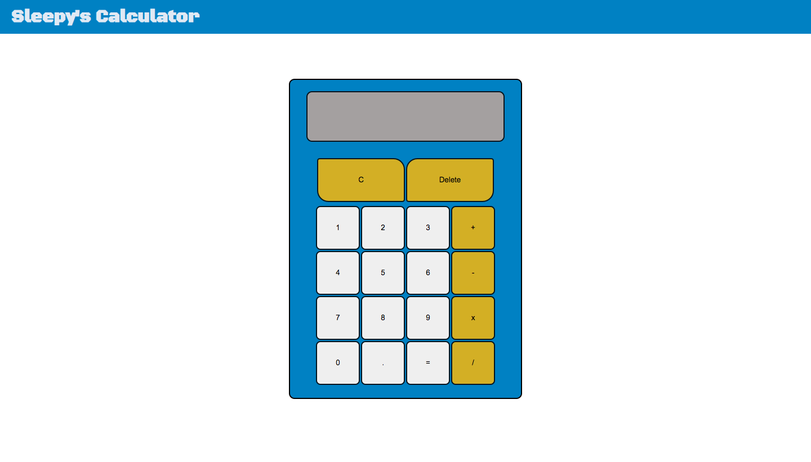

# Calculator

This project is an online calculator, containing the capabilities of a basic calculator, and includes keyboard support. It will be a culmination of the skills acquired in Javascript, as well as a review of HTML and CSS fundamentals.

Overall I found this project easier than the previous Etch-A-Sketch project, perhaps because the logic of it catered to my strengths more. I think there are definitely more efficient ways to execute the calculator than I did, and it's something I'd like to revisit in the future. 

